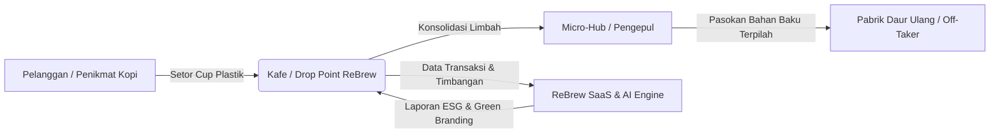

# ☕ ReBrew — Waste Management-as-a-Service (WMaaS) & PilahCash

<div align="center">


### **"Pilah Sampah, Ciptakan Dampak — From Used Cups to New Value"**

[](https://nextjs.org/)
[](https://react.js.org/)
[](https://www.typescriptlang.org/)
[](https://tailwindcss.com/)
[](https://supabase.com/)
[](https://ai.google.dev/)
[](https://www.prisma.io/)

*Platform sirkular ekonomi berbasis micro-hub dan B2B F&B untuk mengonversi sampah cup plastik & limbah kafe menjadi nilai ekonomis, sertifikasi ESG, dan green branding.*

---

</div>

## 📌 Daftar Isi
- [Latar Belakang](#-latar-belakang)
- [Solusi & Model Ekosistem](#-solusi--model-ekosistem)
- [Fitur Utama](#-fitur-utama)
  - [1. PilahCash (Customer Mobile-First App)](#1-pilahcash-customer-mobile-first-app)
  - [2. SaaS Partner Dashboard (Coffee Shop)](#2-saas-partner-dashboard-coffee-shop)
  - [3. Gemini 2.5 Pro AI Waste Diagnostic & ESG Projection](#3-gemini-25-pro-ai-waste-diagnostic--esg-projection)
  - [4. Admin Panel & Verification](#4-admin-panel--verification)
- [Tech Stack & Arsitektur](#-tech-stack--arsitektur)
- [Struktur Direktori](#-struktur-direktori)
- [Memulai (Getting Started)](#-memulai-getting-started)
  - [Prasyarat](#prasyarat)
  - [Instalasi](#instalasi)
  - [Konfigurasi Environment Variables](#konfigurasi-environment-variables)
  - [Menjalankan Aplikasi](#menjalankan-aplikasi)
- [Data Model & Database (Supabase / Postgres)](#-data-model--database-supabase--postgres)
- [Roadmap Pengembangan](#-roadmap-pengembangan)
- [Kontribusi & Lisensi](#-kontribusi--lisensi)

---

## 🌍 Latar Belakang

- **Peringkat Sampah:** Indonesia adalah salah satu penyumbang sampah laut terbesar di dunia, di mana diperkirakan **90% dari 300.000+ ton sampah cup plastik F&B nasional tidak terkelola**.
- **Kepadatan Kedai Kopi:** Terdapat lebih dari **460.000 kedai kopi** di Indonesia, dengan konsentrasi tinggi di Jawa Timur dan Jabodetabek.
- **Tuntutan Gen-Z:** Lebih dari **82% konsumen Gen-Z** menuntut brand/kafe memiliki komitmen ramah lingkungan (*eco-conscious*).
- **Regulasi EPR & KLHK (Permen LHK No. 75/2019):** Sektor F&B dan ritel diwajibkan mengurangi sampah sebesar 30% pada tahun 2029, memerlukan pencatatan daur ulang yang terukur (*traceability*).

---

## 💡 Solusi & Model Ekosistem

**ReBrew** mengubah paradigma pengelolaan sampah dari penjemputan eceran rumah tangga (*B2C door-to-door*) menjadi **konsolidasi titik kumpul komunal (*Micro-Hubs & B2B Coffee Shops*)**:

1. **Efisiensi Logistik:** Mengurangi emisi karbon armada dan biaya operasional penjemputan sampah hingga 70%.
2. **Organic Green Branding:** Kafe menyalurkan limbah cup/plastik dan memperoleh **Sertifikat Eco-Partner**, laporan dampak ESG, dan promosi aplikasi.
3. **AI-Driven Sustainability:** Rekomendasi analitik dan strategi monetisasi limbah berbantuan **Google Gemini 2.5 Pro**.



---

## ✨ Fitur Utama

### 1. PilahCash (Customer Mobile-First App)
- **Kalkulator Poin Real-Time:** Simulasi perolehan poin otomatis berdasarkan kategori sampah (Botol Plastik, Cup Plastik, Tutup Cup, Kardus, Kaleng).
- **Pencarian Drop Point Terdekat:** Peta interaktif, estimasi jarak, dan jam operasional titik setor sampah.
- **Metode Setor Fleksibel:** Drop Point langsung atau opsi penjemputan komunal.
- **Saldo & Riwayat Transaksi:** Riwayat penimbangan sampah terverifikasi dan akumulasi poin reward.

### 2. SaaS Partner Dashboard (Coffee Shop)
- **Live Impact Monitor:** Metrik real-time total kilogram sampah terkumpul, reduksi emisi CO₂ (kg), dan pencapaian target bulanan.
- **Leaderboard & Analyzer:** Peringkat kafe terhijau lintas kota/provinsi.
- **Eco-Partner Certificate & ESG Report:** Pembuatan sertifikat resmi kemitraan hijau dan ringkasan audit keberlanjutan.
- **Share & Flexing Kit:** Ekspor kartu pencapaian visual siap bagikan ke Instagram Stories, WhatsApp, dan TikTok.

### 3. Gemini 2.5 Pro AI Waste Diagnostic & ESG Projection
- **Multi-Step Live Reasoning:** Analisis alur log timbangan, kalkulasi konversi CO₂, dan prediksi tren limbah.
- **AI Actionable Strategy:** Rekomendasi taktis untuk menekan *operational waste* dan strategi monetisasi daur ulang.

### 4. Admin Panel & Verification
- **Manajemen Kategori Sampah:** Pengaturan dinamis poin/kg dan jenis material.
- **Verifikasi Transaksi:** Validasi penimbangan aktual dan konfirmasi status setor.
- **Manajemen Mitra & Drop Point:** Registrasi kafe, penetapan tier kemitraan (*Starter*, *1 Ton Club*, *Enterprise*), dan off-taker.

---

## 🛠 Tech Stack & Arsitektur

| Komponen | Teknologi | Keterangan |
|---|---|---|
| **Frontend Framework** | [Next.js 16 (App Router)](https://nextjs.org/) | Server Components, Server Actions, Dynamic Routing |
| **UI Library** | [React 19](https://react.js.org/) + [TypeScript](https://www.typescriptlang.org/) | Type-safe state & component architecture |
| **Styling & Design System** | [Tailwind CSS v4](https://tailwindcss.com/) | Modern token-based styling & custom palettes |
| **Artificial Intelligence** | [Google Gemini 2.5 Pro SDK](https://ai.google.dev/) (`@google/genai`) | Waste diagnostic, reasoning & actionable ESG insights |
| **Backend & Database** | [Supabase](https://supabase.com/) (PostgreSQL) | Auth SSR, Realtime subscriptions, Storage, Trigger Functions |
| **ORM** | [Prisma ORM 7](https://www.prisma.io/) | Database modeling, schema management & migrations |

---

## 📁 Struktur Direktori

```text
rebrew-indonesianext/
├── app/
│   ├── actions/          # Server actions (Auth, Transaksi, Gemini AI)
│   ├── admin/            # Panel Admin (Kategori, Mitra, Transaksi)
│   ├── dashboard/        # SaaS Partner Dashboard (Coffee Shop)
│   ├── eco-partner/      # Halaman Sertifikasi & Profil Eco-Partner
│   ├── insight/          # Modul AI Diagnostics & ESG Projection
│   ├── login/ & register/# Autentikasi Pengguna & Mitra
│   ├── riwayat/          # Riwayat transaksi setor sampah
│   ├── saldo/            # Manajemen poin reward & penarikan
│   ├── setor/            # Alur setor sampah konsumen (PilahCash)
│   ├── layout.tsx        # Root layout & providers
│   └── page.tsx          # Landing page publik ReBrew
├── components/
│   ├── dashboard/        # Widget analitik, metrik, & grafik
│   ├── forms/            # Komponen form input & dropdown
│   ├── insight/          # Komponen AI Scorecard & Stepper Reasoning
│   ├── shared/           # Navbar, Footer, StatusBadge, QR Display
│   └── ui/               # Reusable atomic UI components
├── lib/                  # Utilities, mock data, & business calculations
├── prisma/               # Schema Prisma ORM
├── supabase/             # Migrasi SQL, policies (RLS), & triggers
├── types/                # Definisi tipe TypeScript
└── utils/                # Supabase SSR client helpers
```

---

## 🚀 Memulai (Getting Started)

### Prasyarat
- [Node.js](https://nodejs.org/) versi 20.x atau lebih baru
- [npm](https://www.npmjs.com/) atau [pnpm](https://pnpm.io/)
- Akun [Supabase](https://supabase.com/) & [Google AI Studio](https://aistudio.google.com/)

### Instalasi

1. **Clone repositori:**
   ```bash
   git clone https://github.com/IhsannulF/ReBrew-10thIndonesiaNEXT.git
   cd ReBrew-10thIndonesiaNEXT
   ```

2. **Instal dependensi:**
   ```bash
   npm install
   ```

### Konfigurasi Environment Variables

Buat file `.env.local` di direktori utama:

```env
# Supabase Configuration
NEXT_PUBLIC_SUPABASE_URL=https://your-supabase-project.supabase.co
NEXT_PUBLIC_SUPABASE_PUBLISHABLE_KEY=your-supabase-publishable-key

# Google Gemini AI
GEMINI_API_KEY=your-google-gemini-api-key
```

### Menjalankan Aplikasi

Jalankan development server:

```bash
npm run dev
```

Buka browser dan akses [http://localhost:3000](http://localhost:3000).

---

## 🗄 Data Model & Database (Supabase / Postgres)

Sistem menggunakan relasi PostgreSQL dengan skema utama:
- `users`: Data akun, peran (`customer`, `mitra`, `admin`), dan agregasi saldo poin.
- `partners`: Data coffee shop, tier status (*Starter*, *1 Ton Club*, *Enterprise*), dan koordinat.
- `drop_points`: Lokasi titik kumpul sampah, alamat, dan penanggung jawab.
- `waste_categories`: Daftar kategori material (PET, PP, Cardboard, Can) dan multiplier poin/kg.
- `transactions` & `transaction_items`: Pencatatan log setor, berat aktual, status verifikasi, dan perolehan poin.
- `impact_summary`: Materialized view/agregat metrik dampak lingkungan bulanan (Kg sampah & reduksi CO₂).

---

## 🗺 Roadmap Pengembangan

- [x] **Fase 1: MVP Core & PilahCash Mobile Flow**
  - Alur setor sampah pelanggan, estimasi poin, dan direktori drop point.
  - Autentikasi berbasis Supabase SSR.
- [x] **Fase 2: SaaS Partner Dashboard & AI Reasoning**
  - Metrik dampak lingkungan & live impact monitor kafe.
  - Integrasi Google Gemini 2.5 Pro untuk diagnosis limbah dan proyeksi ESG.
  - Generator sertifikat Eco-Partner dan social sharing card.
- [ ] **Fase 3: Regional Expansion & Automated Payout**
  - Integrasi payment gateway / e-wallet untuk pencairan poin otomatis.
  - Integrasi penimbangan digital berbasis IoT Micro-Hub.
  - Penyelarasan data pelaporan EPR untuk korporasi FMCG skala besar.

---

## 👥 Tim Pengembang & Inisiatif

Proyek ini dikembangkan dalam rangka inisiatif **10th IndonesiaNEXT** untuk mendorong solusi inovatif di bidang ekonomi sirkular, pengurangan sampah plastik nasional, dan digitalisasi UMKM F&B.

---

<div align="center">
  <sub>Dibangun dengan dedikasi untuk masa depan bumi yang lebih hijau 🍃</sub>
</div>
